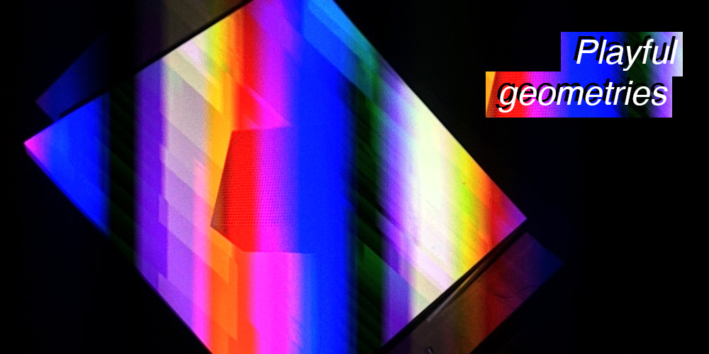

# Playful geometries

## Authors
- Davide, Della Casa, davidedc
- Patrick, Gaunt, paddywwoof

## Description
The primary aim is to have fun. Fun making something and fun playing with
the result. In terms of pushing boundaries we are setting out to make a
device from a $25 Raspberry Pi computer that can compete with a VJ's mac.
Hopefully using a large number of networked cheap computers will produce
something beyond the scope of a single expensive one...

> In the middle of the room is a white table and on to it is projected an
> animated 3D scene. It is a view of the inside of a moving cube with a
> smaller cube also rotating and changing in complicated ways. The
> color and patterns are produced by algrorithms but the animation is 
> synchronised with the music. On other walls are various screens of different
> sizes and orientations showing views of the inside of the larger cube as if
> they are all windows into an animated space outside the room. The experience
> is completely immersive, intruiging, magical.
>
> The visitor sits down on a sofa and picks up a tablet. She idly moves
> sliders and presses buttons. Around her colors and patterns change,
> some parts speed up, some slow down. And the livliness of the music,
> colors and patterns, as they evolve algorithmically, also respond to
> her input.
>
> After long minutes she puts down the tablet and stands up. "But is it art?"
> She wonders. Then off into the next room of the exhibition...

## Link to Prototype
Go to our github project page, link on the left.

## Links to External Libraries
[pi3d raspberry pi opengl es 2](https://github.com/tipam/pi3d "pi3d raspberry pi opengl es 2")
[pi3d documentation](http://pi3d.github.io/html/ReadMe.html)
As well as pi3d we have used
[Pillow python imaging library(https://pypi.python.org/pypi/Pillow/2.3.0)]
[flask python web server(http://flask.pocoo.org)]
[mpg321 mp3 sound file player(http://mpg321.sourceforge.net)]

## Images & Videos

[You can get to a video of the latest prototype here](http://www.eldwick.org.uk/devart1.html)
